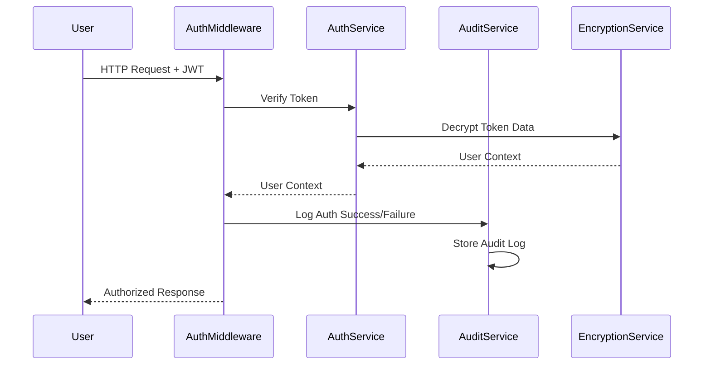
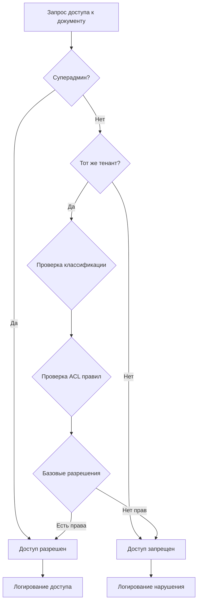

# Этап 14: Система безопасности и ACL

## 🔐 Обзор

Этап 14 значительно усиливает систему безопасности RAG платформы, добавляя расширенную аутентификацию, авторизацию, аудит действий пользователей и шифрование данных в покое.

## ✅ Реализованные возможности

### 1. 🔑 Расширенная система JWT аутентификации

#### Улучшения токенов
- **JWT токены доступа** с настраиваемым временем жизни
- **Токены обновления** для бесшовного продления сессий
- **Черный список токенов** для принудительного logout
- **Метаданные токенов** (IP, User-Agent, время создания)

#### Безопасность токенов
```python
# Пример использования улучшенной аутентификации
@router.post("/secure-endpoint")
async def secure_endpoint(
    current_user: User = Depends(get_current_user),
    request: Request
):
    # Автоматический аудит доступа
    # Проверка прав
    # Логирование действий
```

### 2. 👥 Расширенная система ролей

#### Иерархия ролей
- **SUPER_ADMIN** - Полный доступ ко всем тенантам
- **ADMIN** - Полный доступ в рамках тенанта  
- **USER** - Стандартный пользователь
- **VIEWER** - Только просмотр документов
- **READONLY** - Только чтение без изменений
- **GUEST** - Минимальные права доступа

#### Детализированные разрешения
```python
class Permission(str, Enum):
    # Базовые разрешения
    READ = "read"
    WRITE = "write" 
    DELETE = "delete"
    SHARE = "share"
    
    # Административные разрешения
    ADMIN = "admin"
    USER_MANAGEMENT = "user_mgmt"
    ROLE_MANAGEMENT = "role_mgmt"
    TENANT_SETTINGS = "tenant_settings"
    
    # Системные разрешения
    AUDIT_VIEW = "audit_view"
    METRICS_VIEW = "metrics_view"
    SYSTEM_CONFIG = "system_config"
    
    # API разрешения
    API_ACCESS = "api_access"
    BULK_OPERATIONS = "bulk_ops"
    EXPORT_DATA = "export_data"
```

### 3. 📋 Система документных ACL

#### Классификация документов
- **PUBLIC** - Доступны всем в тенанте
- **INTERNAL** - Доступны сотрудникам
- **CONFIDENTIAL** - Определенным ролям
- **RESTRICTED** - Определенным пользователям  
- **SECRET** - Максимальные ограничения

#### Гранулярный контроль доступа
```python
# Проверка доступа к документу
if DocumentACLService.check_document_access(
    user_context=user_context,
    document_id=document_id,
    required_permission=Permission.READ,
    document_tenant_id=tenant_id,
    document_classification=DocumentClassification.CONFIDENTIAL
):
    # Доступ разрешен
```

#### Фильтрация результатов поиска
- Автоматическая фильтрация по правам доступа
- Поддержка межтенантных операций для админов
- Аудит всех попыток доступа

### 4. 📊 Comprehensive Audit Logging

#### Типы аудируемых действий
```python
class AuditAction(str, Enum):
    LOGIN = "login"
    LOGOUT = "logout"
    DOCUMENT_UPLOAD = "document_upload"
    DOCUMENT_VIEW = "document_view"
    DOCUMENT_DOWNLOAD = "document_download"
    DOCUMENT_DELETE = "document_delete"
    SEARCH_QUERY = "search_query"
    RAG_QUERY = "rag_query"
    USER_CREATE = "user_create"
    USER_UPDATE = "user_update"
    USER_DELETE = "user_delete"
    ROLE_CHANGE = "role_change"
    PERMISSION_GRANT = "permission_grant"
    PERMISSION_REVOKE = "permission_revoke"
    FAILED_LOGIN = "failed_login"
    UNAUTHORIZED_ACCESS = "unauthorized_access"
    SECURITY_VIOLATION = "security_violation"
```

#### Уровни критичности
- **INFO** - Обычные операции
- **WARNING** - Подозрительная активность
- **CRITICAL** - Критические изменения
- **SECURITY** - Нарушения безопасности

#### Детальное логирование
```python
# Автоматическое логирование с контекстом
AuditService.log_action(
    action=AuditAction.DOCUMENT_VIEW,
    level=AuditLevel.INFO,
    user_context=user_context,
    resource_type="document",
    resource_id=document_id,
    ip_address=ip_address,
    user_agent=user_agent,
    details={
        "search_query": query,
        "results_count": count,
        "response_time_ms": response_time
    }
)
```

### 5. 🔒 Шифрование данных в покое

#### Типы шифрования

**Общее шифрование данных**
```python
# Шифрование текстовых данных
encrypted_text = encryption_service.encrypt_text("sensitive data")
decrypted_text = encryption_service.decrypt_text(encrypted_text)

# Шифрование JSON объектов
encrypted_json = encryption_service.encrypt_json({"key": "value"})
decrypted_json = encryption_service.decrypt_json(encrypted_json)
```

**Шифрование документов**
```python
# Специализированное шифрование для документов
document_encryption = DocumentEncryption()

# Шифрование метаданных с сохранением поисковых полей
encrypted_metadata = document_encryption.encrypt_document_metadata({
    "title": "Document Title",  # Остается открытым для поиска
    "author": "John Doe",       # Шифруется
    "content": "Secret content" # Шифруется
})

# Шифрование содержимого с проверкой целостности
encrypted_content = document_encryption.encrypt_document_content(
    content="Document content",
    content_type="text"
)
```

**PII шифрование**
```python
# Специальное шифрование персональных данных
pii_field = pii_encryption.encrypt_pii_field("john@example.com", "email")
# Результат включает зашифрованное значение и search_hint для поиска
```

#### Особенности реализации
- **PBKDF2** для генерации ключей из секретов
- **Fernet** (AES 128) для симметричного шифрования
- **Соль** для хеширования паролей
- **Проверка целостности** документов
- **Search hints** для зашифрованных PII данных

### 6. 🛡️ Middleware безопасности

#### Расширенное AuthMiddleware
- Автоматический аудит всех запросов
- Проверка IP адресов и User-Agent
- Измерение времени аутентификации
- Логирование неудачных попыток доступа

#### Улучшенная обработка ошибок
- Детальное логирование нарушений безопасности
- Автоматические уведомления о критических событиях
- Контекстная информация для расследований

### 7. 🔧 Настройки безопасности

#### Политики паролей
```python
class SecuritySettings(BaseModel):
    password_min_length: int = 8
    password_require_uppercase: bool = True
    password_require_lowercase: bool = True
    password_require_numbers: bool = True
    password_require_symbols: bool = False
    password_expiry_days: Optional[int] = None
    
    max_login_attempts: int = 5
    account_lockout_duration: int = 300
    
    session_timeout_minutes: int = 480
    max_concurrent_sessions: int = 3
    
    require_2fa: bool = False
    allowed_ip_ranges: Optional[List[str]] = None
```

#### Подготовка к 2FA
- Структуры данных для TOTP
- Схемы для резервных кодов
- SMS/Email интеграция (заготовки)

## 🏗️ Архитектура безопасности

### Компоненты системы

```
📁 apps/api/src/
├── 🔐 services/
│   ├── audit.py           # Аудит действий
│   ├── encryption.py      # Шифрование данных  
│   ├── document_acl.py    # ACL для документов
│   └── auth.py           # Аутентификация (улучшена)
├── 🛡️ middleware/
│   └── auth.py           # Middleware с аудитом
├── 📋 schemas/
│   └── auth.py           # Расширенные схемы безопасности
└── 🔗 routers/
    └── auth.py           # Эндпоинты аутентификации
```

### Поток аутентификации



### ACL проверка документов



## 🔒 Безопасность данных

### Уровни защиты

1. **Шифрование в покое**
   - Все чувствительные данные зашифрованы
   - Отдельные ключи для разных типов данных
   - Проверка целостности

2. **Шифрование в передаче**
   - HTTPS для всех соединений
   - Безопасные заголовки JWT

3. **Аудит и мониторинг**
   - Логирование всех действий
   - Автоматические уведомления о нарушениях
   - Трассировка доступа к данным

4. **Контроль доступа**
   - Многоуровневые ACL
   - Разделение по тенантам
   - Гранулярные разрешения

## 📈 Метрики безопасности

### Отслеживаемые показатели

- **Попытки входа**: успешные/неудачные
- **Доступ к документам**: разрешенный/запрещенный  
- **Изменения разрешений**: кто, когда, что
- **Аномальная активность**: необычные IP, времена доступа
- **Производительность**: время аутентификации, шифрования

### Алерты безопасности

- Множественные неудачные попытки входа
- Доступ из необычных локаций
- Попытки повышения привилегий
- Массовый доступ к документам
- Изменения критических настроек

## 🔧 Настройка и развертывание

### Переменные окружения

```bash
# Ключи шифрования
SECRET_KEY=your-super-secret-key
ENCRYPTION_KEY=encryption-key-for-data

# Настройки JWT
JWT_SECRET_KEY=jwt-secret-key
JWT_ALGORITHM=HS256
JWT_ACCESS_TOKEN_EXPIRE_MINUTES=30
JWT_REFRESH_TOKEN_EXPIRE_DAYS=7

# Настройки аудита
AUDIT_LOG_LEVEL=INFO
AUDIT_RETENTION_DAYS=365
SECURITY_ALERT_EMAIL=security@company.com

# Настройки шифрования
DATA_ENCRYPTION_ENABLED=true
PII_ENCRYPTION_ENABLED=true
```

### Зависимости

Добавлены новые зависимости для безопасности:

```requirements.txt
# Безопасность и шифрование
cryptography>=41.0.0
pyotp>=2.8.0
```

## 🧪 Тестирование безопасности

### Тест-кейсы

1. **Аутентификация**
   - Валидация JWT токенов
   - Проверка истечения токенов
   - Блокировка скомпрометированных токенов

2. **Авторизация**
   - Проверка разрешений по ролям
   - ACL для документов
   - Межтенантная изоляция

3. **Аудит**
   - Логирование всех действий
   - Корректность метаданных
   - Производительность логирования

4. **Шифрование**
   - Корректность шифрования/расшифровки
   - Проверка целостности данных
   - Производительность криптографии

### Примеры тестов

```python
def test_document_acl():
    """Тест проверки ACL документов"""
    user_context = UserContext(
        user_id=1,
        username="user",
        tenant_id=1,
        role_id=2,
        permissions=[Permission.READ],
        is_admin=False
    )
    
    # Тест доступа к публичному документу
    assert DocumentACLService.check_document_access(
        user_context=user_context,
        document_id="doc1",
        required_permission=Permission.READ,
        document_tenant_id=1,
        document_classification=DocumentClassification.PUBLIC
    ) == True
    
    # Тест отказа в доступе к секретному документу
    assert DocumentACLService.check_document_access(
        user_context=user_context,
        document_id="doc2", 
        required_permission=Permission.READ,
        document_tenant_id=1,
        document_classification=DocumentClassification.SECRET
    ) == False
```

## 🚀 Использование

### Базовая аутентификация

```python
from fastapi import Depends
from ..middleware.auth import get_current_user, require_permissions
from ..schemas.auth import Permission

@router.get("/protected")
async def protected_endpoint(
    current_user: User = Depends(get_current_user),
    _: None = Depends(require_permissions([Permission.READ]))
):
    return {"message": "Доступ разрешен"}
```

### ACL для документов

```python
from ..services.document_acl import DocumentACLService

@router.get("/documents/{document_id}")
async def get_document(
    document_id: str,
    current_user: User = Depends(get_current_user)
):
    # Автоматическая проверка прав доступа
    if not DocumentACLService.check_document_access(
        user_context=current_user,
        document_id=document_id,
        required_permission=Permission.READ,
        document_tenant_id=current_user.tenant_id
    ):
        raise HTTPException(403, "Недостаточно прав")
    
    # Получение документа...
```

### Аудит действий

```python
from ..services.audit import AuditService, AuditAction

@router.post("/documents")
async def upload_document(
    current_user: User = Depends(get_current_user),
    request: Request
):
    # Загрузка документа...
    
    # Автоматическое логирование
    AuditService.log_document_upload(
        user_context=current_user,
        document_id=new_document_id,
        filename=filename,
        ip_address=request.client.host
    )
```

### Шифрование данных

```python
from ..services.encryption import encryption_service, document_encryption

# Шифрование чувствительных данных
sensitive_data = {"ssn": "123-45-6789", "credit_card": "1234-5678-9012-3456"}
encrypted_data = encryption_service.encrypt_json(sensitive_data)

# Шифрование документа
content_info = document_encryption.encrypt_document_content(
    content=document_text,
    content_type="text/plain"
)
```

## 🔮 Будущие улучшения

### Планируемые возможности

1. **Двухфакторная аутентификация (2FA)**
   - TOTP (Google Authenticator)
   - SMS коды
   - Email коды
   - Резервные коды

2. **Продвинутая аналитика безопасности**
   - ML для обнаружения аномалий
   - Поведенческая аналитика
   - Риск-скоринг пользователей

3. **Интеграции безопасности**
   - LDAP/Active Directory
   - OAuth 2.0/OpenID Connect
   - SAML SSO

4. **Шифрование ключей**
   - Hardware Security Modules (HSM)
   - Azure Key Vault / AWS KMS
   - Ротация ключей

5. **Compliance**
   - GDPR совместимость
   - SOC 2 Type II
   - ISO 27001

## 📊 Производительность

### Бенчмарки

- **Аутентификация**: < 50ms на запрос
- **ACL проверка**: < 10ms на документ
- **Шифрование**: < 5ms для текста до 1MB
- **Аудит логирование**: < 2ms на событие

### Оптимизации

- Кэширование разрешений пользователей
- Пакетная обработка аудит логов
- Асинхронное шифрование больших данных
- Индексирование таблиц ACL

## 🏆 Заключение

Этап 14 значительно повышает уровень безопасности RAG платформы:

✅ **Многоуровневая аутентификация** с JWT токенами  
✅ **Гранулярная авторизация** с детальными разрешениями  
✅ **Comprehensive аудит** всех действий пользователей  
✅ **Шифрование данных в покое** для защиты чувствительной информации  
✅ **Документные ACL** для точного контроля доступа  
✅ **Tenant изоляция** для мультитенантности  
✅ **Подготовка к 2FA** и advanced security features  

Система теперь готова для enterprise-уровня безопасности и соответствует современным стандартам защиты данных.

Переходим к **Этапу 15: Интеграция с внешними системами** 🚀
