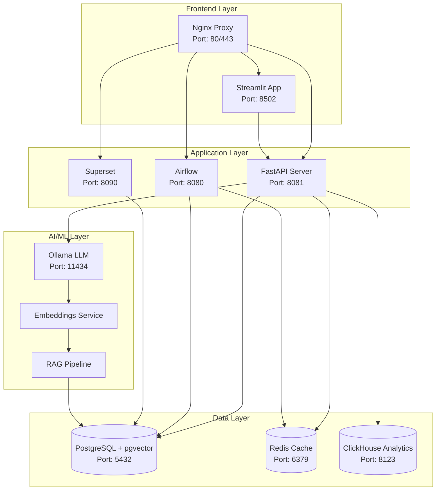

# 🔧 Руководство администратора RAG Platform

## 🎯 Введение

Добро пожаловать в руководство администратора RAG Platform! Эта документация предназначена для системных администраторов, DevOps инженеров и технических специалистов, ответственных за развертывание, настройку и обслуживание платформы.

## 📖 Содержание

1. [🏗️ Архитектура системы](#-архитектура-системы)
2. [⚙️ Установка и развертывание](#-установка-и-развертывание)
3. [🔧 Конфигурация системы](#-конфигурация-системы)
4. [👥 Управление пользователями](#-управление-пользователями)
5. [📊 Мониторинг и аналитика](#-мониторинг-и-аналитика)
6. [🛡️ Безопасность](#-безопасность)
7. [🚀 Производительность и оптимизация](#-производительность-и-оптимизация)
8. [🔄 Резервное копирование](#-резервное-копирование)
9. [🆘 Диагностика и устранение неполадок](#-диагностика-и-устранение-неполадок)

## 🏗️ Архитектура системы

### Компоненты системы



### Технологический стек

| Компонент | Технология | Версия | Назначение |
|-----------|------------|--------|------------|
| **Frontend** | Streamlit | 1.28+ | Веб-интерфейс пользователя |
| **API** | FastAPI | 0.104+ | RESTful API сервер |
| **Database** | PostgreSQL + pgvector | 15+ | Основная БД и векторное хранилище |
| **Cache** | Redis | 7+ | Кэширование и очереди |
| **Analytics** | ClickHouse | 23+ | Аналитическая БД для метрик |
| **LLM** | Ollama | Latest | Локальные языковые модели |
| **Orchestration** | Apache Airflow | 2.7+ | Управление процессами ETL |
| **Visualization** | Apache Superset | 3+ | Дашборды и отчеты |
| **Proxy** | Nginx | 1.24+ | Обратный прокси и балансировка |
| **Container** | Docker | 24+ | Контейнеризация |
| **Orchestration** | Kubernetes | 1.28+ | Оркестрация контейнеров |

### Требования к ресурсам

#### Минимальные требования (Development)
- **CPU**: 4 ядра
- **RAM**: 8 GB
- **Storage**: 50 GB SSD
- **Network**: 100 Mbps

#### Рекомендуемые требования (Production)
- **CPU**: 16 ядер
- **RAM**: 64 GB
- **Storage**: 1 TB NVMe SSD
- **Network**: 1 Gbps
- **GPU**: Опционально для ускорения AI

#### Enterprise требования
- **CPU**: 32+ ядер
- **RAM**: 128+ GB
- **Storage**: 10+ TB с репликацией
- **Network**: 10 Gbps
- **High Availability**: Кластер из 3+ нод

## ⚙️ Установка и развертывание

### Быстрое развертывание (Docker Compose)

#### 1. Подготовка окружения
```bash
# Клонирование репозитория
git clone https://github.com/rag-platform/rag-platform.git
cd rag-platform

# Создание конфигурации
cp infra/compose/env.example infra/compose/.env.local

# Редактирование конфигурации
nano infra/compose/.env.local
```

#### 2. Конфигурация .env.local
```bash
# Основные настройки
ENVIRONMENT=production
COMPOSE_PROJECT_NAME=rag-platform

# Порты сервисов
STREAMLIT_PORT=8502
API_PORT=8081
SUPERSET_PORT=8090
AIRFLOW_PORT=8080
POSTGRES_PORT=5432
REDIS_PORT=6379
CLICKHOUSE_PORT=8123
OLLAMA_PORT=11434

# Базы данных
POSTGRES_USER=rag_user
POSTGRES_PASSWORD=secure_password_2024!
POSTGRES_DB=rag_db

# Безопасность
JWT_SECRET_KEY=$(openssl rand -hex 64)
JWT_ALGORITHM=HS256
JWT_EXPIRE_MINUTES=60

# Кэширование
REDIS_TTL=3600
CACHE_TTL=1800

# Логирование
LOG_LEVEL=INFO
LOG_FORMAT=json

# Мониторинг
METRICS_ENABLED=true
PROMETHEUS_PORT=9090
GRAFANA_PORT=3000

# AI/ML настройки
EMBEDDING_MODEL=bge-m3
LLM_MODEL=llama2-7b
OLLAMA_MODELS=llama2,bge-m3,nomic-embed-text

# Производительность
MAX_WORKERS=4
MAX_CONNECTIONS=100
UPLOAD_MAX_SIZE=100MB
```

#### 3. Запуск системы
```bash
# Полное развертывание
cd infra/compose
docker compose up -d

# Проверка статуса
docker compose ps

# Просмотр логов
docker compose logs -f api
```

### Kubernetes развертывание

#### 1. Подготовка кластера
```bash
# Создание namespace
kubectl create namespace rag-platform

# Создание секретов
kubectl create secret generic rag-platform-secrets \
  --namespace=rag-platform \
  --from-literal=jwt-secret-key=$(openssl rand -hex 64) \
  --from-literal=postgres-password=$(openssl rand -base64 32) \
  --from-literal=redis-password=$(openssl rand -base64 32)
```

#### 2. Helm развертывание
```bash
# Добавление Helm репозиториев
helm repo add bitnami https://charts.bitnami.com/bitnami
helm repo add prometheus-community https://prometheus-community.github.io/helm-charts
helm repo update

# Установка зависимостей
helm dependency update infra/helm/rag-platform

# Развертывание
helm install rag-platform infra/helm/rag-platform \
  --namespace rag-platform \
  --values infra/helm/rag-platform/values.yaml \
  --wait --timeout 15m
```

#### 3. Проверка развертывания
```bash
# Статус подов
kubectl get pods -n rag-platform

# Статус сервисов
kubectl get svc -n rag-platform

# Логи приложения
kubectl logs -f deployment/rag-platform-api -n rag-platform

# Health check
kubectl port-forward svc/rag-platform-api 8081:8081 -n rag-platform &
curl http://localhost:8081/health
```

### Production развертывание

#### 1. Подготовка инфраструктуры
```bash
# AWS EKS кластер
eksctl create cluster \
  --name rag-platform-prod \
  --version 1.28 \
  --region us-east-1 \
  --nodegroup-name workers \
  --node-type m5.2xlarge \
  --nodes 3 \
  --nodes-min 3 \
  --nodes-max 10 \
  --managed

# Установка дополнений
kubectl apply -f https://raw.githubusercontent.com/kubernetes/ingress-nginx/main/deploy/static/provider/aws/deploy.yaml
```

#### 2. Конфигурация production values
```yaml
# production-values.yaml
global:
  environment: production
  imageTag: "v1.0.0"
  domain: rag-platform.com

api:
  replicas: 3
  autoscaling:
    enabled: true
    minReplicas: 3
    maxReplicas: 10
    targetCPUUtilizationPercentage: 70
  resources:
    requests:
      cpu: 500m
      memory: 1Gi
    limits:
      cpu: 2000m
      memory: 4Gi

postgresql:
  primary:
    persistence:
      size: 500Gi
      storageClass: gp3
  readReplicas:
    replicaCount: 2

redis:
  cluster:
    enabled: true
    nodes: 6

monitoring:
  enabled: true
  prometheus:
    enabled: true
  grafana:
    enabled: true

ingress:
  enabled: true
  className: nginx
  annotations:
    cert-manager.io/cluster-issuer: letsencrypt-prod
    nginx.ingress.kubernetes.io/rate-limit: "1000"
  tls:
    - secretName: rag-platform-tls
      hosts:
        - rag-platform.com
```

#### 3. Blue-Green развертывание
```bash
# Скрипт автоматического развертывания
#!/bin/bash
set -e

NAMESPACE="rag-platform-production"
RELEASE_NAME="rag-platform"
NEW_VERSION=$1

if [ -z "$NEW_VERSION" ]; then
  echo "Usage: $0 <version>"
  exit 1
fi

echo "🚀 Starting Blue-Green deployment for version $NEW_VERSION"

# 1. Deploy Green version
echo "📦 Deploying Green version..."
helm upgrade --install ${RELEASE_NAME}-green infra/helm/rag-platform \
  --namespace $NAMESPACE \
  --values production-values.yaml \
  --set global.imageTag=$NEW_VERSION \
  --set nameOverride="green" \
  --wait --timeout 15m

# 2. Health check
echo "🔍 Running health checks..."
kubectl wait --for=condition=ready pod -l app.kubernetes.io/name=rag-platform,version=green \
  -n $NAMESPACE --timeout=300s

# 3. Smoke tests
echo "💨 Running smoke tests..."
kubectl run smoke-test --rm -i --image=curlimages/curl:latest --restart=Never -- \
  curl -f http://rag-platform-api-green.$NAMESPACE.svc.cluster.local:8081/health

# 4. Switch traffic
echo "🔄 Switching traffic to Green..."
kubectl patch service rag-platform-api -n $NAMESPACE \
  -p '{"spec":{"selector":{"version":"green"}}}'

# 5. Wait and cleanup
echo "⏰ Waiting 5 minutes before cleanup..."
sleep 300

# 6. Remove Blue version
echo "🧹 Cleaning up Blue version..."
helm uninstall ${RELEASE_NAME}-blue -n $NAMESPACE || true

echo "✅ Blue-Green deployment completed successfully!"
```

## 🔧 Конфигурация системы

### Конфигурация API сервера

#### settings/config.py
```python
from pydantic_settings import BaseSettings
from typing import List, Optional

class Settings(BaseSettings):
    # Основные настройки
    app_name: str = "RAG Platform API"
    environment: str = "production"
    debug: bool = False
    
    # Сервер
    api_host: str = "0.0.0.0"
    api_port: int = 8081
    workers: int = 4
    
    # База данных
    database_url: str
    database_pool_size: int = 20
    database_max_overflow: int = 30
    database_pool_timeout: int = 30
    
    # Redis
    redis_url: str
    redis_ttl: int = 3600
    redis_max_connections: int = 100
    
    # ClickHouse
    clickhouse_url: str
    clickhouse_database: str = "rag_metrics"
    
    # JWT
    jwt_secret_key: str
    jwt_algorithm: str = "HS256"
    jwt_expire_minutes: int = 60
    
    # CORS
    cors_origins: List[str] = ["*"]
    cors_methods: List[str] = ["GET", "POST", "PUT", "DELETE"]
    
    # Rate Limiting
    rate_limit_requests: int = 1000
    rate_limit_window: int = 3600
    
    # File Upload
    upload_max_size: int = 100 * 1024 * 1024  # 100MB
    upload_allowed_extensions: List[str] = [
        ".pdf", ".docx", ".txt", ".html", ".xlsx", ".eml"
    ]
    
    # AI/ML
    ollama_base_url: str = "http://ollama:11434"
    embedding_model: str = "bge-m3"
    llm_model: str = "llama2-7b"
    embedding_dimension: int = 1536
    
    # Logging
    log_level: str = "INFO"
    log_format: str = "json"
    log_file: Optional[str] = None
    
    # Monitoring
    metrics_enabled: bool = True
    prometheus_port: int = 9090
    health_check_interval: int = 30
    
    # Security
    data_encryption_enabled: bool = True
    audit_logging_enabled: bool = True
    session_timeout: int = 3600
    
    class Config:
        env_file = ".env"
        case_sensitive = False
```

### Конфигурация Nginx

#### nginx.conf
```nginx
upstream api_backend {
    least_conn;
    server api-1:8081 max_fails=3 fail_timeout=30s;
    server api-2:8081 max_fails=3 fail_timeout=30s;
    server api-3:8081 max_fails=3 fail_timeout=30s;
    keepalive 32;
}

upstream streamlit_backend {
    ip_hash;  # Для WebSocket соединений
    server streamlit-1:8502 max_fails=3 fail_timeout=30s;
    server streamlit-2:8502 max_fails=3 fail_timeout=30s;
    keepalive 16;
}

server {
    listen 80;
    server_name rag-platform.com;
    return 301 https://$server_name$request_uri;
}

server {
    listen 443 ssl http2;
    server_name rag-platform.com;
    
    # SSL Configuration
    ssl_certificate /etc/ssl/certs/rag-platform.crt;
    ssl_certificate_key /etc/ssl/private/rag-platform.key;
    ssl_protocols TLSv1.2 TLSv1.3;
    ssl_ciphers ECDHE-RSA-AES128-GCM-SHA256:ECDHE-RSA-AES256-GCM-SHA384;
    ssl_prefer_server_ciphers off;
    
    # Security Headers
    add_header X-Frame-Options DENY;
    add_header X-Content-Type-Options nosniff;
    add_header X-XSS-Protection "1; mode=block";
    add_header Strict-Transport-Security "max-age=31536000; includeSubDomains";
    
    # Rate Limiting
    limit_req_zone $binary_remote_addr zone=api:10m rate=100r/m;
    limit_req_zone $binary_remote_addr zone=upload:10m rate=10r/m;
    
    # Main Application
    location / {
        proxy_pass http://streamlit_backend;
        proxy_set_header Host $host;
        proxy_set_header X-Real-IP $remote_addr;
        proxy_set_header X-Forwarded-For $proxy_add_x_forwarded_for;
        proxy_set_header X-Forwarded-Proto $scheme;
        
        # WebSocket support
        proxy_http_version 1.1;
        proxy_set_header Upgrade $http_upgrade;
        proxy_set_header Connection "upgrade";
        proxy_read_timeout 86400;
    }
    
    # API Endpoints
    location /api/ {
        limit_req zone=api burst=20 nodelay;
        
        proxy_pass http://api_backend;
        proxy_set_header Host $host;
        proxy_set_header X-Real-IP $remote_addr;
        proxy_set_header X-Forwarded-For $proxy_add_x_forwarded_for;
        proxy_set_header X-Forwarded-Proto $scheme;
        
        # Timeouts
        proxy_connect_timeout 30s;
        proxy_send_timeout 60s;
        proxy_read_timeout 60s;
    }
    
    # File Upload (extended timeout)
    location /api/v1/documents/upload {
        limit_req zone=upload burst=5 nodelay;
        
        proxy_pass http://api_backend;
        proxy_set_header Host $host;
        proxy_set_header X-Real-IP $remote_addr;
        proxy_set_header X-Forwarded-For $proxy_add_x_forwarded_for;
        proxy_set_header X-Forwarded-Proto $scheme;
        
        # Extended timeouts for file upload
        proxy_connect_timeout 60s;
        proxy_send_timeout 300s;
        proxy_read_timeout 300s;
        
        # Large file support
        client_max_body_size 100M;
        proxy_request_buffering off;
    }
    
    # Health Check
    location /health {
        access_log off;
        return 200 "healthy\n";
        add_header Content-Type text/plain;
    }
    
    # Static Files
    location /static/ {
        alias /var/www/static/;
        expires 1y;
        add_header Cache-Control "public, immutable";
    }
}
```

### Конфигурация PostgreSQL

#### postgresql.conf оптимизация
```sql
-- Performance Settings
shared_buffers = '8GB'                    -- 25% of RAM
effective_cache_size = '24GB'             -- 75% of RAM
work_mem = '256MB'                        -- For complex queries
maintenance_work_mem = '2GB'              -- For maintenance ops
wal_buffers = '64MB'                      -- WAL buffer size

-- Checkpoint Settings
checkpoint_completion_target = 0.9
wal_level = replica
max_wal_size = '4GB'
min_wal_size = '1GB'

-- Connection Settings
max_connections = 200
shared_preload_libraries = 'pg_stat_statements,auto_explain'

-- Logging
log_destination = 'jsonlog'
log_statement = 'mod'
log_min_duration_statement = 1000        -- Log slow queries
auto_explain.log_min_duration = 1000     -- Explain slow queries

-- Vector Extension Settings
shared_preload_libraries = 'vector'
```

#### Создание индексов для производительности
```sql
-- Оптимизация поиска документов
CREATE INDEX CONCURRENTLY idx_documents_user_created 
ON documents(user_id, created_at DESC);

CREATE INDEX CONCURRENTLY idx_documents_content_type 
ON documents(content_type) WHERE content_type IS NOT NULL;

CREATE INDEX CONCURRENTLY idx_documents_tags 
ON documents USING GIN(tags);

-- Оптимизация векторного поиска
CREATE INDEX CONCURRENTLY idx_chunks_embedding_cosine 
ON document_chunks USING ivfflat (embedding vector_cosine_ops) 
WITH (lists = 1000);

-- Партиционирование для логов
CREATE TABLE audit_logs (
    id BIGSERIAL,
    user_id INTEGER,
    action VARCHAR(50),
    created_at TIMESTAMP DEFAULT NOW(),
    details JSONB
) PARTITION BY RANGE (created_at);

-- Создание партиций на год вперед
DO $$
DECLARE
    start_date DATE := DATE_TRUNC('month', CURRENT_DATE);
    end_date DATE;
BEGIN
    FOR i IN 0..11 LOOP
        end_date := start_date + INTERVAL '1 month';
        EXECUTE format('CREATE TABLE audit_logs_%s PARTITION OF audit_logs 
                       FOR VALUES FROM (%L) TO (%L)',
                       TO_CHAR(start_date, 'YYYY_MM'),
                       start_date,
                       end_date);
        start_date := end_date;
    END LOOP;
END
$$;
```

### Конфигурация Redis

#### redis.conf оптимизация
```ini
# Memory Management
maxmemory 8gb
maxmemory-policy allkeys-lru

# Persistence
save 900 1
save 300 10
save 60 10000

# Network
tcp-keepalive 300
timeout 0

# Performance
tcp-backlog 511
databases 16

# Security
requirepass your_secure_redis_password
rename-command FLUSHDB ""
rename-command FLUSHALL ""
rename-command CONFIG "CONFIG_b835556"

# Logging
loglevel notice
logfile /var/log/redis/redis-server.log

# Slow Log
slowlog-log-slower-than 10000
slowlog-max-len 128
```

## 👥 Управление пользователями

### Создание пользователей

#### Через API
```python
import requests

# Создание администратора
admin_data = {
    "username": "admin_user",
    "email": "admin@company.com",
    "password": "SecureAdminPass123!",
    "full_name": "System Administrator",
    "role": "admin",
    "organization": "IT Department"
}

response = requests.post(
    "https://api.rag-platform.com/api/v1/admin/users",
    headers={"Authorization": "Bearer ADMIN_TOKEN"},
    json=admin_data
)
```

#### Через командную строку
```bash
# Создание суперпользователя
docker exec -it rag-platform-api python -c "
from src.services.auth import AuthService
from src.schemas.auth import UserRole

user = AuthService.create_user(
    username='superadmin',
    email='super@company.com',
    password='SuperSecurePass123!',
    full_name='Super Administrator',
    role=UserRole.SUPER_ADMIN
)
print(f'Superuser created: {user.username}')
"
```

### Управление ролями и разрешениями

#### Роли пользователей
```python
# Определение ролей
class UserRole(str, Enum):
    SUPER_ADMIN = "super_admin"  # Полный доступ к системе
    ADMIN = "admin"              # Управление пользователями и контентом
    USER = "user"                # Стандартный пользователь
    VIEWER = "viewer"            # Просмотр документов
    READONLY = "readonly"        # Только чтение
    GUEST = "guest"              # Ограниченный доступ

# Права доступа
class Permission(str, Enum):
    READ = "read"
    WRITE = "write"
    DELETE = "delete"
    SHARE = "share"
    ADMIN = "admin"
    USER_MANAGEMENT = "user_mgmt"
    ROLE_MANAGEMENT = "role_mgmt"
    TENANT_SETTINGS = "tenant_settings"
    AUDIT_VIEW = "audit_view"
    METRICS_VIEW = "metrics_view"
    SYSTEM_CONFIG = "system_config"
    API_ACCESS = "api_access"
    BULK_OPERATIONS = "bulk_ops"
    EXPORT_DATA = "export_data"
```

#### Настройка прав доступа
```python
# Матрица разрешений
ROLE_PERMISSIONS = {
    UserRole.SUPER_ADMIN: [
        Permission.ADMIN, Permission.USER_MANAGEMENT, 
        Permission.ROLE_MANAGEMENT, Permission.SYSTEM_CONFIG,
        Permission.AUDIT_VIEW, Permission.METRICS_VIEW,
        Permission.READ, Permission.WRITE, Permission.DELETE,
        Permission.SHARE, Permission.API_ACCESS,
        Permission.BULK_OPERATIONS, Permission.EXPORT_DATA
    ],
    UserRole.ADMIN: [
        Permission.USER_MANAGEMENT, Permission.TENANT_SETTINGS,
        Permission.AUDIT_VIEW, Permission.METRICS_VIEW,
        Permission.READ, Permission.WRITE, Permission.DELETE,
        Permission.SHARE, Permission.API_ACCESS,
        Permission.BULK_OPERATIONS, Permission.EXPORT_DATA
    ],
    UserRole.USER: [
        Permission.READ, Permission.WRITE, Permission.SHARE,
        Permission.API_ACCESS, Permission.EXPORT_DATA
    ],
    UserRole.VIEWER: [
        Permission.READ, Permission.API_ACCESS
    ],
    UserRole.READONLY: [
        Permission.READ
    ],
    UserRole.GUEST: [
        Permission.READ  # Ограниченный
    ]
}
```

### Массовые операции

#### Импорт пользователей из CSV
```python
import pandas as pd
import requests

def import_users_from_csv(csv_file_path, admin_token):
    """Импорт пользователей из CSV файла"""
    df = pd.read_csv(csv_file_path)
    
    headers = {"Authorization": f"Bearer {admin_token}"}
    url = "https://api.rag-platform.com/api/v1/admin/users"
    
    results = []
    for _, row in df.iterrows():
        user_data = {
            "username": row['username'],
            "email": row['email'],
            "full_name": row['full_name'],
            "role": row.get('role', 'user'),
            "organization": row.get('organization', ''),
            "password": row.get('password', 'TempPass123!')  # Временный пароль
        }
        
        try:
            response = requests.post(url, headers=headers, json=user_data)
            response.raise_for_status()
            results.append({"username": row['username'], "status": "success"})
        except Exception as e:
            results.append({"username": row['username'], "status": f"error: {e}"})
    
    return results

# Пример использования
results = import_users_from_csv("users.csv", "ADMIN_TOKEN")
for result in results:
    print(f"{result['username']}: {result['status']}")
```

#### Массовое обновление ролей
```bash
# SQL запрос для массового обновления
docker exec -it rag-platform-postgres psql -U postgres -d rag_db -c "
UPDATE users 
SET role = 'viewer', updated_at = NOW() 
WHERE organization = 'External Partners' 
  AND role = 'user';
"
```

## 📊 Мониторинг и аналитика

### Prometheus метрики

#### Основные метрики приложения
```python
from prometheus_client import Counter, Histogram, Gauge, start_http_server

# HTTP метрики
http_requests_total = Counter(
    'http_requests_total',
    'Total HTTP requests',
    ['method', 'endpoint', 'status_code']
)

http_request_duration = Histogram(
    'http_request_duration_seconds',
    'HTTP request duration',
    ['method', 'endpoint']
)

# Бизнес метрики
documents_uploaded_total = Counter(
    'documents_uploaded_total',
    'Total documents uploaded',
    ['user_role', 'content_type']
)

search_queries_total = Counter(
    'search_queries_total', 
    'Total search queries',
    ['search_type', 'user_role']
)

rag_queries_total = Counter(
    'rag_queries_total',
    'Total RAG queries',
    ['model', 'user_role']
)

# Системные метрики
active_users = Gauge(
    'active_users_total',
    'Number of active users',
    ['time_window']
)

database_connections = Gauge(
    'database_connections_active',
    'Active database connections',
    ['database']
)

cache_hit_rate = Gauge(
    'cache_hit_rate',
    'Cache hit rate percentage',
    ['cache_type']
)
```

#### Конфигурация Prometheus
```yaml
# prometheus.yml
global:
  scrape_interval: 15s
  evaluation_interval: 15s

rule_files:
  - "rag_platform_rules.yml"

alerting:
  alertmanagers:
    - static_configs:
        - targets:
          - alertmanager:9093

scrape_configs:
  - job_name: 'rag-platform-api'
    static_configs:
      - targets: ['api:9090']
    metrics_path: /metrics
    scrape_interval: 15s
    scrape_timeout: 10s
    
  - job_name: 'rag-platform-streamlit'
    static_configs:
      - targets: ['streamlit:9091']
    
  - job_name: 'postgres-exporter'
    static_configs:
      - targets: ['postgres-exporter:9187']
    
  - job_name: 'redis-exporter'
    static_configs:
      - targets: ['redis-exporter:9121']
    
  - job_name: 'node-exporter'
    static_configs:
      - targets: ['node-exporter:9100']
```

### Grafana дашборды

#### Дашборд производительности API
```json
{
  "dashboard": {
    "title": "RAG Platform API Performance",
    "panels": [
      {
        "title": "HTTP Request Rate",
        "type": "graph",
        "targets": [
          {
            "expr": "rate(http_requests_total[5m])",
            "legendFormat": "{{method}} {{endpoint}}"
          }
        ]
      },
      {
        "title": "Response Time Percentiles",
        "type": "graph", 
        "targets": [
          {
            "expr": "histogram_quantile(0.50, rate(http_request_duration_seconds_bucket[5m]))",
            "legendFormat": "50th percentile"
          },
          {
            "expr": "histogram_quantile(0.95, rate(http_request_duration_seconds_bucket[5m]))",
            "legendFormat": "95th percentile"
          },
          {
            "expr": "histogram_quantile(0.99, rate(http_request_duration_seconds_bucket[5m]))",
            "legendFormat": "99th percentile"
          }
        ]
      },
      {
        "title": "Error Rate",
        "type": "singlestat",
        "targets": [
          {
            "expr": "rate(http_requests_total{status_code=~\"5..\"}[5m]) / rate(http_requests_total[5m]) * 100",
            "legendFormat": "Error Rate %"
          }
        ]
      }
    ]
  }
}
```

### Алерты и уведомления

#### Правила алертов
```yaml
# rag_platform_rules.yml
groups:
  - name: rag_platform_alerts
    rules:
      - alert: HighErrorRate
        expr: rate(http_requests_total{status_code=~"5.."}[5m]) / rate(http_requests_total[5m]) > 0.05
        for: 2m
        labels:
          severity: critical
        annotations:
          summary: "High error rate detected"
          description: "Error rate is {{ $value }}% for the last 5 minutes"
      
      - alert: HighResponseTime
        expr: histogram_quantile(0.95, rate(http_request_duration_seconds_bucket[5m])) > 2
        for: 5m
        labels:
          severity: warning
        annotations:
          summary: "High response time"
          description: "95th percentile response time is {{ $value }}s"
      
      - alert: DatabaseConnectionsHigh
        expr: database_connections_active > 150
        for: 2m
        labels:
          severity: warning
        annotations:
          summary: "High number of database connections"
          description: "Database has {{ $value }} active connections"
      
      - alert: LowCacheHitRate
        expr: cache_hit_rate < 50
        for: 5m
        labels:
          severity: warning
        annotations:
          summary: "Low cache hit rate"
          description: "Cache hit rate is {{ $value }}%"
      
      - alert: ServiceDown
        expr: up == 0
        for: 1m
        labels:
          severity: critical
        annotations:
          summary: "Service is down"
          description: "{{ $labels.job }} has been down for more than 1 minute"
```

#### Конфигурация AlertManager
```yaml
# alertmanager.yml
global:
  smtp_smarthost: 'smtp.company.com:587'
  smtp_from: 'alerts@rag-platform.com'

route:
  group_by: ['alertname']
  group_wait: 10s
  group_interval: 10s
  repeat_interval: 1h
  receiver: 'web.hook'
  routes:
    - match:
        severity: critical
      receiver: 'critical-alerts'
    - match:
        severity: warning
      receiver: 'warning-alerts'

receivers:
  - name: 'critical-alerts'
    email_configs:
      - to: 'admin@company.com'
        subject: 'CRITICAL: RAG Platform Alert'
        body: |
          Alert: {{ .GroupLabels.alertname }}
          Summary: {{ range .Alerts }}{{ .Annotations.summary }}{{ end }}
          Description: {{ range .Alerts }}{{ .Annotations.description }}{{ end }}
    slack_configs:
      - api_url: 'YOUR_SLACK_WEBHOOK_URL'
        channel: '#critical-alerts'
        title: 'CRITICAL: RAG Platform Alert'
        text: '{{ range .Alerts }}{{ .Annotations.summary }}{{ end }}'
  
  - name: 'warning-alerts'
    email_configs:
      - to: 'devops@company.com'
        subject: 'WARNING: RAG Platform Alert'
        body: |
          Alert: {{ .GroupLabels.alertname }}
          Summary: {{ range .Alerts }}{{ .Annotations.summary }}{{ end }}
  
  - name: 'web.hook'
    webhook_configs:
      - url: 'http://webhook-service:5000/alerts'
```

### Логирование

#### Структурированное логирование
```python
import structlog
import logging.config

# Конфигурация логирования
LOGGING_CONFIG = {
    "version": 1,
    "disable_existing_loggers": False,
    "formatters": {
        "json": {
            "()": structlog.stdlib.ProcessorFormatter,
            "processor": structlog.dev.ConsoleRenderer(colors=False),
        },
    },
    "handlers": {
        "default": {
            "level": "INFO",
            "class": "logging.StreamHandler",
            "formatter": "json",
        },
        "file": {
            "level": "INFO",
            "class": "logging.handlers.RotatingFileHandler",
            "filename": "/app/logs/rag-platform.log",
            "maxBytes": 100*1024*1024,  # 100MB
            "backupCount": 10,
            "formatter": "json",
        },
    },
    "loggers": {
        "": {
            "handlers": ["default", "file"],
            "level": "INFO",
            "propagate": True,
        },
    },
}

# Настройка structlog
structlog.configure(
    processors=[
        structlog.stdlib.filter_by_level,
        structlog.stdlib.add_logger_name,
        structlog.stdlib.add_log_level,
        structlog.stdlib.PositionalArgumentsFormatter(),
        structlog.processors.TimeStamper(fmt="iso"),
        structlog.processors.StackInfoRenderer(),
        structlog.processors.format_exc_info,
        structlog.processors.UnicodeDecoder(),
        structlog.processors.JSONRenderer()
    ],
    context_class=dict,
    logger_factory=structlog.stdlib.LoggerFactory(),
    wrapper_class=structlog.stdlib.BoundLogger,
    cache_logger_on_first_use=True,
)
```

#### Централизованное логирование с ELK Stack
```yaml
# filebeat.yml
filebeat.inputs:
- type: log
  enabled: true
  paths:
    - /app/logs/*.log
  fields:
    service: rag-platform-api
    environment: production
  fields_under_root: true
  json.keys_under_root: true

output.elasticsearch:
  hosts: ["elasticsearch:9200"]
  index: "rag-platform-%{+yyyy.MM.dd}"

setup.template.name: "rag-platform"
setup.template.pattern: "rag-platform-*"
```

Продолжу создание остальных разделов документации...
